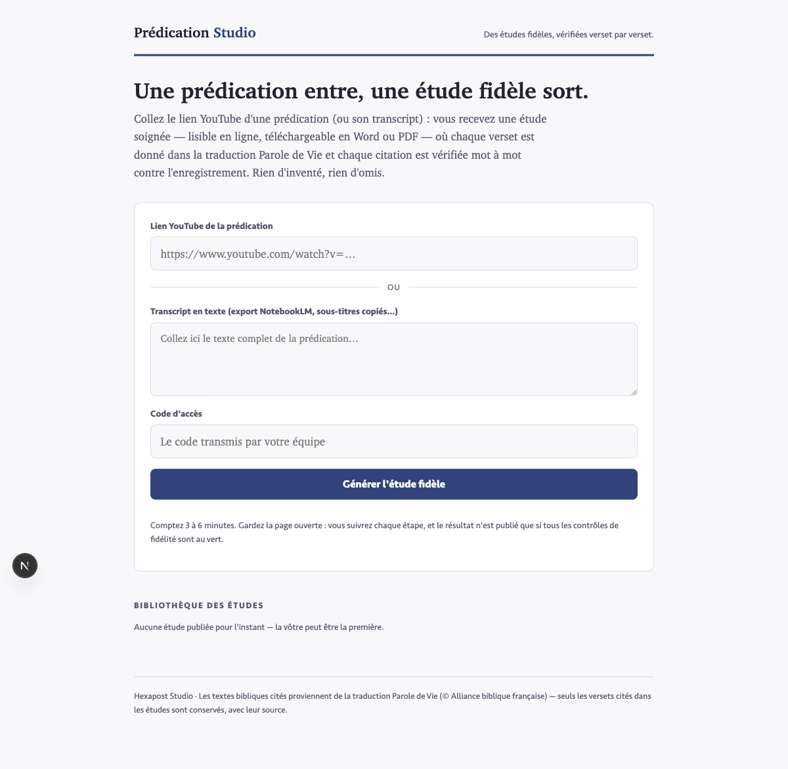
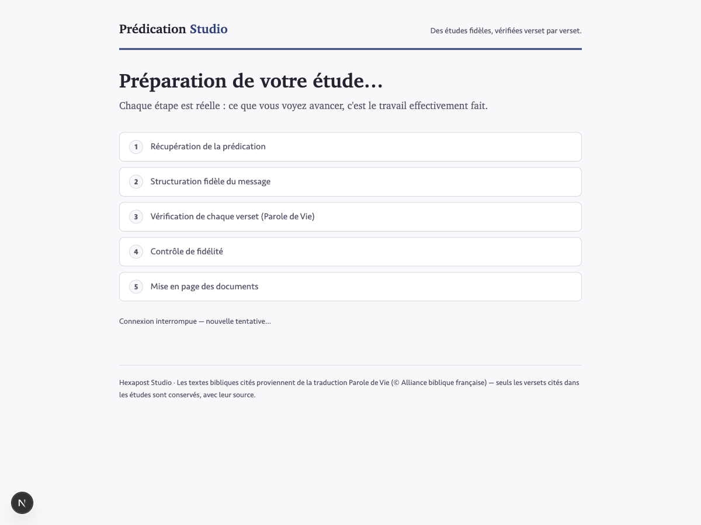

# 📖 Prédication Studio — web

L'interface grand public du pipeline [predication-studio](https://github.com/hexapost-studio/predication-studio) :
**une prédication entre (lien YouTube ou transcript), une étude fidèle sort** — lisible en ligne,
téléchargeable en Word et PDF, chaque verset vérifié dans la traduction *Parole de Vie*, chaque
citation contrôlée mot à mot contre l'enregistrement.

Toute la complexité (ingestion, structuration IA sous contrat, résolution des versets depuis un
cache vérifié, contrôles de fidélité bloquants, rendus) est **cachée côté serveur** : le visiteur
voit cinq étapes en langage simple et un « certificat de fidélité ».

## Fonctionnement

```
Lien YouTube / texte collé
      │  /api/jobs (code d'accès + quota journalier)
      ▼
Récupération → Structuration IA → Versets (cache PDV) → Contrôles → Mise en page
                (claude-sonnet-5,   (jamais l'IA)        (bloquants,   (HTML + Word)
                 contrat strict)                          double passe
                                                          auto si échec)
      ▼
Étude publiée dans la bibliothèque + certificat de fidélité
```

- **Jobs par étapes** : chaque étape est un appel court ; l'état vit dans Supabase, la page de
  suivi enchaîne les appels — compatible serverless, relançable, progression réelle affichée.
- **Le texte biblique ne sort jamais du modèle** : cache `pdv_cache` (amorcé avec 82 versets
  vérifiés), complété par récupération bible.com (PDV2017) pour les références nouvelles.
- **Rien n'est publié si un contrôle échoue** : vocabulaire, versets (trois sens), citations
  verbatim, couverture complète du transcript. Une passe de correction automatique est tentée,
  sinon le job s'arrête en montrant le rapport.

## Stack

Next.js 16 (App Router) · Supabase (Postgres) · modèle au choix (OpenRouter gratuit ou payant, Anthropic, OpenAI) · déploiement Vercel.
Aucun binaire externe : sous-titres YouTube via l'API timedtext, Word via `docx` (JS pur),
PDF via l'impression navigateur (CSS print embarqué dans chaque étude).

## Installer chez soi

[](https://vercel.com/new/clone?repository-url=https%3A%2F%2Fgithub.com%2Fhexapost-studio%2Fpredication-studio-web&env=OPENROUTER_API_KEY,SUPABASE_URL,SUPABASE_SERVICE_ROLE_KEY,LLM_MODEL&envDescription=Cle%20du%20modele%20IA%20et%20acces%20Supabase&envLink=https%3A%2F%2Fgithub.com%2Fhexapost-studio%2Fpredication-studio-web%2Fblob%2Fmain%2F.env.example&project-name=predication-studio&repository-name=predication-studio)

Chacun peut déployer sa propre instance : **[INSTALLATION.md](INSTALLATION.md)** — en un
clic, sur son ordinateur, ou en ligne de commande (~10 min, comptes gratuits).

**Gratuit ou payant, au choix.** L'app accepte OpenRouter (modèles `:free` à 0 €, ou
modèles payants), Anthropic ou OpenAI. Les contrôles de fidélité sont identiques dans
tous les cas : un modèle gratuit échoue plus souvent aux contrôles (donc plus de
reprises), il ne publiera jamais un document non conforme. Détail et limites du palier
gratuit : [INSTALLATION.md](INSTALLATION.md#gratuit-ou-payant).

Notes d'exploitation (quotas, codes d'accès, `maxDuration`) : [DEPLOIEMENT.md](DEPLOIEMENT.md).

## Origine

Les règles de fidélité, le contrat de structuration, les contrôles et le cache de versets
proviennent du repo [predication-studio](https://github.com/hexapost-studio/predication-studio)
(pipeline local, skill Claude Code `/predication`), validé sur les prédications du Camp IC2026
et un culte complet EJP. Le script `scripts/sanity.ts` vérifie que les ports TypeScript
reproduisent les verdicts du pipeline d'origine sur le corpus étalon.

© Hexapost Studio — dépôt privé. Textes bibliques cités : *Parole de Vie* © Alliance biblique
française (seuls les versets cités dans les études sont conservés, avec leur source).

## Aperçu

| Accueil | Suivi de génération |
|---|---|
|  |  |
